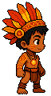

  

## Grupo
- Nícolas Fantauzzi  
- Davi Kauã  
- Kauã Gustavo  
- Izabela Cassiano  
- Julia Franco  
- João Pedro  

---

# Sobre o Projeto

**Yawara** é um jogo 2D de aventura, exploração e combate desenvolvido na Godot Engine.  
O projeto é inspirado no folclore brasileiro, na biodiversidade nacional e em elementos da cultura indígena, trazendo uma narrativa focada na preservação da natureza e no equilíbrio entre humanidade e meio ambiente.

O jogo se passa em um Brasil afetado por uma força misteriosa que corrompe a fauna, a flora e os espíritos naturais do país. Ao longo da jornada, o jogador deverá explorar diferentes regiões brasileiras, enfrentar criaturas corrompidas e descobrir os segredos por trás do despertar de Yawara.

# História

O Brasil começou a mudar.

As florestas ficaram silenciosas.  
Os rios perderam o brilho.  
Animais desapareceram das matas e criaturas estranhas passaram a surgir entre árvores, cavernas e cidades abandonadas.

Segundo antigas lendas, quando a natureza entrasse em desequilíbrio, uma entidade ancestral despertaria: **Yawara**, o grande felino espiritual e guardião da fauna e da flora brasileira.

Porém, algo deu errado.

Ao despertar, Yawara foi consumido por uma força sombria conhecida como **A Sombra da Ruptura**, transformando os espíritos naturais do Brasil em monstros agressivos e espalhando corrupção por todo o território.

Agora, o destino da natureza depende de um novo guardião.

# Personagem Principal

O jogador controla **Aruan**, um jovem explorador ligado espiritualmente à natureza.

Quando criança, Aruan encontrou um antigo amuleto indígena perdido nas profundezas da floresta amazônica. Anos depois, o artefato desperta e concede a ele a habilidade de invocar as **Cartas de Defensores** — espíritos inspirados em animais, povos originários e elementos naturais brasileiros.

Com esses poderes, Aruan deverá atravessar diferentes regiões do país, solucionar enigmas em ruínas ancestrais e enfrentar criaturas corrompidas até encontrar Yawara e restaurar o equilíbrio da natureza.

# Objetivos do Jogo

- Explorar cenários inspirados em biomas brasileiros  
- Enfrentar criaturas corrompidas pela Sombra da Ruptura  
- Resolver enigmas e desafios ambientais  
- Utilizar cartas espirituais em combate  
- Restaurar o equilíbrio da natureza  

# Tecnologias Utilizadas

- Godot Engine 4.5 Stable  
- GDScript  
- Pixel Art  

# Pré-requisitos

Para executar o projeto é necessário possuir:

- Godot Engine 4.5 Stable instalada  

# Acessibilidade

O projeto até o momento conta com os itens de acessibilidade disponíveis na planilha abaixo:

[Planilha de Acessibilidade](https://1drv.ms/x/c/af28c7372be2bc7b/IQCME2kCQXE9QaOznKgSMcIiAbiKFgsoctzGw00bB5ojo2Q?e=nh1yQM)

---

# Imagens do Projeto

## Menu Principal

## Menu de Configurações

## Personagem Principal - Aruan

---

# Links Importantes

- Repositório do projeto  [Repositório do projeto](https://github.com/TP-Coltec-UFMG/2026-303-Yawara)
- Documentação da Godot Engine  
- Planilha de acessibilidade  [Planilha de Acessibilidade](https://1drv.ms/x/c/af28c7372be2bc7b/IQCME2kCQXE9QaOznKgSMcIiAbiKFgsoctzGw00bB5ojo2Q?e=nh1yQM)
- GDC [Game Design Canvas](https://canva.link/rjgcj1knudb7w90)

