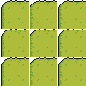
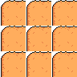
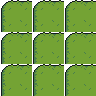
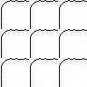

<p align="center">


  <strong>Um roguelite 2D de exploração, combate e evolução inspirado na fauna, nos ambientes e nas narrativas brasileiras.</strong>
</p>

---

## 🎮 Sobre o jogo

**Ecos do Brasil: Yawara** é um protótipo de **roguelite top-down 2D**, desenvolvido na **Godot Engine 4.7**, que combina exploração, combate, evolução corporal, interação com a fauna e diferentes estratégias de jogo.

A proposta é construir uma experiência inspirada na biodiversidade brasileira, utilizando diferentes ambientes, animais e elementos de narrativas brasileiras para criar o universo do jogo.

Durante uma partida, o jogador explora um mundo gerado proceduralmente, encontra diferentes criaturas, coleta alimentos, enfrenta inimigos, escolhe evoluções e desenvolve uma build própria.

O jogo também apresenta diferentes possibilidades de progressão. O jogador pode priorizar combate, velocidade, resistência, ataques à distância, interação social, companheiros, alimentação ou combinações entre esses estilos.

Além das mecânicas de gameplay, o projeto possui **recursos de acessibilidade integrados ao menu de configurações**, permitindo adaptar aspectos visuais e de interação da experiência.

> **Estado atual:** protótipo jogável em desenvolvimento, com sistemas de exploração, combate, evolução, fauna, biomas, menus, acessibilidade e confronto com Yawara implementados.

---

# História

O equilíbrio dos ambientes naturais brasileiros está sendo afetado por uma força de corrupção chamada **Sombra da Ruptura**.

Essa força altera o comportamento das criaturas e transforma parte da fauna em ameaças.

O jogador percorre diferentes ambientes para sobreviver, evoluir e compreender o que está acontecendo com o mundo.

Durante a jornada, encontra animais, criaturas corrompidas, pontos de interação e guardiões relacionados às diferentes regiões.

No final da partida surge **Yawara**, uma entidade original criada para o jogo e inspirada simbolicamente na figura da onça como guardiã da natureza.

O confronto contra Yawara representa o principal desafio da jornada.

> **Observação:** Yawara é uma criação original do projeto e não representa diretamente uma entidade específica de uma tradição folclórica brasileira. As referências culturais são utilizadas como inspiração para a construção do universo do jogo.

---

# Objetivo

O objetivo principal é **explorar, sobreviver e evoluir até o confronto final contra Yawara**.

Durante a partida, o jogador pode:

* explorar diferentes regiões;
* encontrar e interagir com animais;
* coletar frutas e outros alimentos;
* enfrentar criaturas;
* evitar combates;
* desenvolver atributos;
* escolher evoluções;
* adquirir novas armas;
* criar companheiros;
* enfrentar minibosses;
* adaptar-se às condições do ambiente;
* construir diferentes builds;
* enfrentar Yawara.

---

# 🕹️ Como jogar

## Controles

| Tecla / Controle       | Função                             |
| ---------------------- | ---------------------------------- |
| `WASD` / Setas         | Mover                              |
| Mouse esquerdo/direito | Atacar                             |
| `J`                    | Atacar                             |
| `Space`                | Dash                               |
| `F`                    | Usar Ultimate                      |
| `T`                    | Alternar Ultimate desbloqueada     |
| `G`                    | Alternar tipo de Dash desbloqueado |
| `C` / `Tab`            | Abrir tela de Build                |
| `E`                    | Interagir com POIs e amizades      |
| `Q` / `R`              | Trocar arma                        |
| `1–5`                  | Selecionar arma                    |
| `X`                    | Reroll na escolha de Evolution     |
| `U`                    | Elevar raridade na Evolution       |

### Alimentação

Frutas e carnes podem ser coletadas simplesmente passando sobre elas.

As quatro mordidas acontecem automaticamente de acordo com o atributo **Feeding Speed**.

---

# Estrutura da partida

A partida possui uma progressão baseada em tempo:

```text
INÍCIO
  ↓
Exploração e evolução
  ↓
03:00 — Miniboss
  ↓
Exploração e desenvolvimento
  ↓
06:00 — Miniboss
  ↓
Preparação para o confronto
  ↓
08:00 — Yawara
  ↓
Confronto final
```

Características principais:

* cronômetro crescente durante toda a partida;
* miniboss aos `03:00`;
* miniboss aos `06:00`;
* Yawara aos `08:00`;
* confronto final de até aproximadamente 2 minutos;
* mundo gerado proceduralmente;
* quatro regiões/biomas;
* fauna com diferentes relações ecológicas;
* frutas, árvores, pedras e lagos;
* pontos sociais;
* minibosses;
* diferentes modos de jogo.

---

# Biomas e regiões

O jogo possui **quatro grandes ambientes gerados proceduralmente**.

Os mapas utilizam manchas de biomas irregulares baseadas em **Voronoi**, criando uma distribuição variável das regiões.

## Grande Floresta

Ambiente inspirado principalmente em regiões de floresta brasileiras.



**Descrição da imagem:** textura de terreno utilizada para representar a região da Grande Floresta no jogo.

---

## Sertão de Pedra

Ambiente inspirado principalmente na **Caatinga**, com uma aparência mais seca e rochosa.



**Descrição da imagem:** textura de terreno utilizada para representar o ambiente do Sertão de Pedra.

---

## Águas do Pantanal

Ambiente inspirado principalmente no **Pantanal e no Cerrado**, com presença de áreas relacionadas à água.



**Descrição da imagem:** textura de terreno utilizada para representar a região das Águas do Pantanal.

---

## Campos de Geada

Ambiente inspirado em paisagens do Sul do Brasil, incluindo referências aos **Pampas e às Araucárias**.



**Descrição da imagem:** textura de terreno utilizada para representar os Campos de Geada.

---

# 🐾 Fauna

A fauna do jogo é inspirada em espécies brasileiras.

Entre as criaturas presentes estão:

* Capivara;
* Ema;
* Mico-leão-dourado;
* Quero-quero;
* Arara;
* Tatu-peba;
* Paca;
* Graxaim;
* Queixada;
* Carcará;
* Tamanduá-bandeira;
* Quati;
* Veado-campeiro;
* Gato-do-mato;
* Lobo-guará;
* Bugio.

Também existem versões corrompidas de algumas espécies.

### Comportamentos

As criaturas possuem diferentes comportamentos ecológicos:

* **Predadores:** atacam outras criaturas;
* **Presas:** podem fugir de ameaças;
* **Territoriais:** defendem determinadas áreas;
* **Passivas:** normalmente não atacam o jogador.

Essas relações contribuem para a criação de um pequeno ecossistema dentro do mundo do jogo.

---

# Sistema de combate

O jogo possui diferentes tipos de armas e ataques.

## Garras

Ataque corporal de curto alcance.

O desempenho está relacionado às características físicas do personagem.

## Lança

Ataque corpo a corpo com maior alcance.

## Zarabatana

Arma de ataque à distância.

## Boleadeira

Projétil utilizado para atacar inimigos e aplicar efeitos de controle, como lentidão.

## Maracá Ancestral

Arma especial baseada em pulsos circulares.

Seu desempenho está relacionado ao atributo **Social** e às afinidades do personagem.

---

# Evolução e builds

O jogo possui um sistema de evolução que permite ao jogador modificar suas características durante a partida.

O projeto possui:

* **51 stats internos**;
* **23 Genetics**;
* **130 entradas no catálogo de Evolutions**;
* **4 níveis de raridade**;
* sistema de **Mutagen**;
* **Progress**;
* **Splicing**;
* Specialisations;
* ataques;
* Ultimates;
* movimentos e Dashes.

As escolhas feitas durante a partida modificam a forma como o personagem funciona.

## Exemplos de builds

### Pequeno e rápido

Foco em:

* velocidade;
* esquiva;
* velocidade de ataque;
* menor tamanho.

### Grande e resistente

Foco em:

* dano;
* área de ataque;
* resistência;
* tamanho.

O personagem fica mais lento, mas consegue causar mais impacto.

### Social

Foco em:

* amizade;
* companheiros;
* encontros;
* Maracá;
* suporte durante o confronto final.

### Pacifista

Foco em:

* alimentação;
* exploração;
* interação;
* amizade com animais;
* menor dependência do combate.

### Ranged

Foco em:

* Zarabatana;
* Boleadeira;
* ataques à distância.

### Corpo a corpo

Foco em:

* Garras;
* Lança;
* dano físico;
* tamanho.

Também é possível combinar diferentes características e criar builds híbridas.

---

# 🤝 Sistema Social

O atributo **Social** permite uma forma diferente de progressão.

Durante a exploração, o jogador pode encontrar animais e estabelecer relações com eles.

Dependendo da relação construída, determinados animais podem se tornar companheiros.

Os companheiros podem auxiliar:

* durante a exploração;
* contra predadores;
* contra inimigos;
* contra minibosses;
* durante o confronto contra Yawara.

O sistema permite que a interação com a fauna seja parte da estratégia do jogador.

---

# 🍎 Alimentação

O mundo possui alimentos que podem ser coletados durante a exploração.

Frutas aparecem em árvores e no ambiente.

Ao passar sobre um alimento, o personagem inicia automaticamente o processo de alimentação.

A alimentação utiliza **quatro mordidas**, controladas pelo atributo **Feeding Speed**.

A alimentação está relacionada à progressão e pode contribuir para:

* recuperação;
* Progress;
* evolução;
* afinidades;
* estratégias pacifistas.

A carne também pode aparecer no ambiente como consequência das relações entre as criaturas.

---

# Minibosses

Durante uma partida Normal, minibosses aparecem em momentos específicos.

Existem **cinco minibosses associados aos ambientes do jogo**.

Entre eles estão:

| Região       | Miniboss             | Recompensa            |
| ------------ | -------------------- | --------------------- |
| Norte        | Mapinguari           | Coração do Mapinguari |
| Nordeste     | Cabra Cabriola       | Sol do Sertão         |
| Centro-Oeste | Minhocão do Pantanal | Passo do Pantanal     |
| Sudeste      | Corpo-Seco da Serra  | Casca da Serra        |
| Sul          | Teiniaguá Corrompida | Brasa da Teiniaguá    |

Cada miniboss possui uma recompensa com efeitos relacionados à região e às características do ambiente.

---

# 🐆 Yawara

Yawara é o principal desafio do jogo.

Ela surge aos **08:00** na partida Normal.

A batalha possui diferentes fases e utiliza elementos como:

* projéteis;
* áreas de perigo;
* meteoros;
* ataques venenosos;
* criaturas auxiliares;
* mudanças de fase.

As escolhas feitas durante a partida — armas, evoluções, atributos e companheiros — influenciam a preparação para esse confronto.

---

# Ecossistema

O mundo possui diferentes relações entre as criaturas.

Existem:

* predadores;
* presas;
* criaturas territoriais;
* criaturas passivas;
* animais que fogem;
* animais que atacam;
* interações entre diferentes espécies.

---

# Mundo procedural

O mapa é gerado proceduralmente.

A geração utiliza diferentes regiões e **manchas de biomas baseadas em Voronoi**.

O mundo pode apresentar:

* árvores;
* pedras;
* lagos;
* frutas;
* animais;
* inimigos;
* pontos de encontro;
* comunidades;
* santuários;
* minibosses;
* outros pontos de interesse.

Ao todo, o projeto possui **14 POIs (Points of Interest)**.

---

# Ambiente

O jogo possui sistemas relacionados às condições do ambiente.

Entre eles estão:

* ciclo de dia e noite;
* eventos climáticos;
* temperatura;
* calor;
* frio;
* água/Soak;
* características específicas do terreno.

Esses sistemas também estão relacionados às possibilidades de evolução e adaptação do personagem.

---

# Modos de jogo

## Normal

É o modo principal da experiência.

O jogador explora, evolui, enfrenta os minibosses e chega ao confronto contra Yawara.

## Pressure

Modo com diferentes níveis de pressão e dificuldade.

Possui progressão de **Pressure 0 até Pressure 20**, com escalas e desbloqueios próprios.

## Endless

Modo de sobrevivência contínua.

Após a estrutura normal da partida, o jogador pode continuar jogando em níveis repetíveis.

---

# ♿ Acessibilidade

A acessibilidade faz parte do desenvolvimento do projeto.

O jogo possui um **menu de acessibilidade disponível dentro das configurações**.

## Menu acessível

Entre as opções disponíveis estão:

### Alto contraste

Aumenta a diferenciação visual entre elementos para facilitar sua identificação.

### Escala de texto

Permite aumentar o tamanho global dos textos da interface.

### Contorno de texto

Auxilia na leitura dos textos em diferentes fundos.

### Redução de flashes

Reduz efeitos visuais de flash presentes durante determinados eventos.

### Redução de movimento

Permite reduzir determinados movimentos da câmera.

### Screen Shake

O efeito de tremor da tela pode ser ativado ou desativado.

Também existe controle da intensidade do efeito.

### Aim Assist

Possui diferentes níveis de assistência de mira:

* Desativado;
* Leve;
* Forte.

Essas opções permitem que diferentes jogadores adaptem a experiência de acordo com suas necessidades.

---

# Idiomas

O projeto possui suporte para:

* 🇧🇷 **Português (Brasil)**
* 🇺🇸 **English**
* 🇪🇸 **Español**

A troca de idioma é realizada através das configurações.

---

# ⚙️ Configurações

O jogo possui um sistema de gerenciamento de configurações.

As opções incluem:

* vídeo;
* áudio;
* idioma;
* acessibilidade.

As preferências são armazenadas pelo sistema de configurações para serem reutilizadas.

---

# Cenas do projeto

As imagens abaixo devem apresentar o estado atual do desenvolvimento.

## Menu inicial

**Descrição:** tela principal do jogo, utilizada para iniciar uma partida, escolher o modo de jogo e acessar as configurações.

>  **Inserir screenshot do menu inicial aqui.**

---

## ♿ Menu de acessibilidade

**Descrição:** tela que apresenta as opções de acessibilidade disponíveis, incluindo alto contraste, escala de texto, redução de flashes, redução de movimento, Screen Shake e Aim Assist.

>  **Inserir screenshot do menu de acessibilidade aqui.**

---

##  Gameplay

**Descrição:** tela durante a partida, mostrando o personagem explorando o mundo, o ambiente e as criaturas.

>  **Inserir screenshot do gameplay aqui.**

---

##  Tela de evolução

**Descrição:** tela utilizada durante a partida para escolher novas evoluções e modificar as características do personagem.

>  **Inserir screenshot da tela de evolução aqui.**

---

## Tela de Build

**Descrição:** tela que apresenta os atributos, evoluções, afinidades e características atuais do personagem.

>  **Inserir screenshot da Build aqui.**

---

##  Confronto contra Yawara

**Descrição:** batalha final do jogo, apresentando Yawara, seus ataques, áreas de perigo e as diferentes fases do confronto.

>  **Inserir screenshot da batalha contra Yawara aqui.**

---

# Tecnologias

O projeto foi desenvolvido utilizando:

* **Godot Engine 4.7**
* **GDScript**
* Git
* GitHub
* Pixel Art
* Animação 2D
* Geração procedural
* Sistemas de colisão e física
* Sistemas de configuração
* Sistema de localização

---

# Estrutura do projeto

```text
2026-303-Yawara/
│
├── assets/
│   ├── audio/
│   ├── shaders/
│   └── sprites/
│
├── scenes/
│   ├── boss/
│   ├── effects/
│   ├── enemies/
│   ├── player/
│   ├── ui/
│   └── world/
│
├── scripts/
│   ├── boss/
│   ├── components/
│   ├── core/
│   ├── effects/
│   ├── enemies/
│   ├── player/
│   ├── ui/
│   └── world/
│
├── project.godot
│
├── README.md
├── GAMEPLAY_SYSTEMS.md
├── SETTINGS_AND_LANGUAGES.md
├── FOLCLORE_DESIGN.md
├── MAPA_E_BUILD.md
├── TEST_CHECKLIST.md
├── SPRITES_TODO.md
└── outros documentos
```

---

# ▶ Como abrir

1. Clone ou baixe o repositório.
2. Abra a **Godot Engine 4.7.x**.
3. Selecione o arquivo:

```text
project.godot
```

4. Importe/abra o projeto.
5. Execute utilizando `F5` ou `F6`.

A cena principal é o **menu do jogo**.

---

#  Atalhos para teste

Durante o desenvolvimento existem atalhos que facilitam os testes:

| Tecla | Função                             |
| ----- | ---------------------------------- |
| `F2`  | Ir quase imediatamente para Yawara |
| `F3`  | Adicionar XP                       |
| `F4`  | Causar dano à Yawara               |
| `F5`  | Forçar o miniboss do bioma atual   |

Esses atalhos são destinados principalmente aos testes durante o desenvolvimento.

---

# Documentação

O repositório possui documentação complementar:

### `GAMEPLAY_SYSTEMS.md`

Descrição dos principais sistemas de gameplay.

### `SETTINGS_AND_LANGUAGES.md`

Documentação das configurações, idiomas e recursos de acessibilidade.

### `FOLCLORE_DESIGN.md`

Documentação das referências utilizadas na construção do universo e dos elementos culturais do jogo.

### `MAPA_E_BUILD.md`

Informações relacionadas ao mapa e às builds.

### `GUIA_INSTALACAO_ASSETS.md`

Orientações para instalação e organização dos assets.

### `SPRITES_TODO.md`

Inventário dos sprites e elementos visuais.

### `TEST_CHECKLIST.md`

Checklist para testes dos sistemas do jogo.

### `SYSTEMS_V3.md`

Documentação de sistemas implementados.

### `UPDATE_NOTES_V2.md`, `UPDATE_NOTES_V4.md` e `UPDATE_NOTES_V5.md`

Registros das atualizações realizadas durante o desenvolvimento.

### `VALIDATION_REPORT.txt`

Relatório de validação do projeto.

---

# Estado atual

## Sistemas implementados

* [x] Personagem jogável
* [x] Movimentação
* [x] Dash
* [x] Ataques
* [x] Ultimate
* [x] Diferentes armas
* [x] Evoluções
* [x] Genetics
* [x] Splicing
* [x] Mutagen
* [x] Progress
* [x] Sistema de raridade
* [x] Sistema Social
* [x] Companheiros
* [x] Alimentação
* [x] Fauna brasileira
* [x] Relações predador/presa
* [x] Mundo procedural
* [x] Biomas
* [x] POIs
* [x] Ciclo dia/noite
* [x] Eventos climáticos
* [x] Sistema de calor e frio
* [x] Minibosses
* [x] Yawara
* [x] Menu principal
* [x] Menu de Build
* [x] Menu de Evolution
* [x] Configurações
* [x] Menu de acessibilidade
* [x] Alto contraste
* [x] Escala de texto
* [x] Redução de flashes
* [x] Redução de movimento
* [x] Screen Shake configurável
* [x] Aim Assist
* [x] Português
* [x] Inglês
* [x] Espanhol
* [x] Modo Normal
* [x] Pressure 0–20
* [x] Endless

---

# Próximos passos

Os próximos passos do projeto incluem:

* continuar os testes das mecânicas;
* realizar balanceamento dos sistemas;
* aprimorar os mapas e ambientes;
* melhorar sprites e animações;
* revisar comportamentos das criaturas;
* continuar os testes de acessibilidade;
* revisar a experiência do confronto contra Yawara;
* corrigir bugs encontrados durante os testes;
* realizar testes com jogadores;
* melhorar efeitos sonoros e visuais;
* continuar a documentação;
* preparar a versão final do projeto.

---

# 👥 Grupo de Desenvolvimento:
**Turma:** 303
- Izabela Cassiano  
- Nicolas Fantauzzi  
- Davi Kauã  
- Kauan Gustavo  
- Júlia Franco  
- João Pedro  

---


# Links Importantes

- Repositório do projeto  [Repositório do projeto](https://github.com/TP-Coltec-UFMG/2026-303-Yawara)
- Documentação da Godot Engine  
- Planilha de acessibilidade  [Planilha de Acessibilidade](https://1drv.ms/x/c/af28c7372be2bc7b/IQCME2kCQXE9QaOznKgSMcIiAbiKFgsoctzGw00bB5ojo2Q?e=nh1yQM)
- GDC [Game Design Canvas](https://canva.link/rjgcj1knudb7w90)

